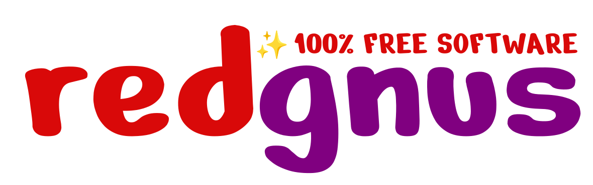
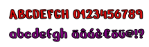

<!--
  SPDX-FileCopyrightText: 2021 Pablo Hörtner
  SPDX-License-Identifier: AGPL-3.0-or-later

  Copyright © 2021 by Pablo Hörtner <redtux@pm.me>. All rights reserved.
  You can find the AGPL v3.0 here: https://www.gnu.org/licenses/agpl-3.0
  Attribution required if you use these markdown files for your projects.
-->

# Logo

> **redgnus** · *100% FREE SOFTWARE

1. [Avatar](#avatar)
2. [Font](#font)
3. [Emoji](#emoji)
4. [Licensing](#licensing)

> Official logo of the redgnus project

- Created with [Inkscape](http://www.inkscape.org/)
- Font: [Nerko One](https://fonts.google.com/specimen/Nerko+One)
- Primary color: `#d90909`
- Secondary color: `#800080`

## Avatar

> Official avatar and favicon of the redgnus project

- Based on the sparkles emoji (`CTRL+U+2728`)

## Font

> Nerko One by Nermin Kahrimanovic

- Copyright (c) 2013 [The Nerko One Project Authors](https://github.com/nermink99/Nerko/)
- SIL Open Font License, Version 1.1 ([OFL](https://github.com/nermink99/Nerko/blob/master/OFL.txt))

## Emoji

> Noto Emoji by Google

- SIL Open Font License, version 1.1 ([OFL](https://github.com/google/fonts/blob/main/ofl/notosans/OFL.txt))
- Source: [OpenType-SVG version of sparkles emoji](https://github.com/adobe-fonts/noto-emoji-svg/blob/master/svg/u2728.svg)

## Licensing

- Copyright © 2021 [Pablo Hörtner](https://redtux.github.io/) and contributors
- [Creative Commons Attribution-ShareAlike 4.0][CC-BY-SA-4.0]

<!-- References -->
[CC-BY-SA-4.0]: https://spdx.org/licenses/CC-BY-SA-4.0 "CC BY-SA 4.0 License"
